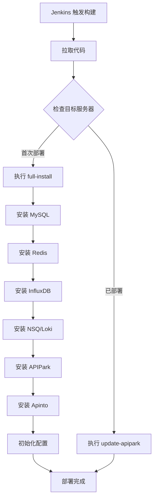

# APIPark Jenkins Freestyle 部署指南

本文档说明如何使用 Jenkins **自由风格项目（Freestyle）** 部署 APIPark。

---

## 一、架构说明

```
┌─────────────────┐      SSH/部署脚本       ┌─────────────────┐
│   Jenkins 服务器  │ ──────────────────────> │  部署目标服务器    │
│                 │                         │                 │
│  - 拉取代码       │                         │  - Docker       │
│  - 构建镜像       │                         │  - MySQL        │
│  - 推送镜像       │                         │  - Redis        │
│  - 触发部署       │                         │  - APIPark      │
└─────────────────┘                         └─────────────────┘
```

---

## 二、前置条件

### 2.1 Jenkins 服务器要求

| 工具 | 版本 | 用途 |
|------|------|------|
| Docker | 20.x+ | 构建和推送镜像 |
| Git | 2.x+ | 拉取代码 |
| SSH Client | - | 远程连接部署服务器 |

### 2.2 部署目标服务器要求

| 工具 | 版本 | 用途 |
|------|------|------|
| Docker | 20.x+ | 运行容器 |
| Docker Compose | 2.x+ | 可选，编排容器 |
| bash | 4.x+ | 执行部署脚本 |

### 2.3 硬件要求

| 资源 | 最低要求 | 推荐配置 |
|------|----------|----------|
| CPU | 2 核 | 4 核+ |
| 内存 | 4 GB | 8 GB+ |
| 磁盘 | 20 GB | 50 GB+ |

---

## 三、Jenkins 全局配置

### 3.1 安装必要插件

进入 **Manage Jenkins → Manage Plugins → 可选插件**，搜索并安装：

- `SSH Plugin` - 远程执行命令
- `Publish Over SSH` - SSH 部署
- `Docker Plugin` - Docker 集成
- `Git Plugin` - Git 支持

### 3.2 配置 SSH 凭据

进入 **Manage Jenkins → Manage Credentials → System → Global credentials**：

1. 点击 **Add Credentials**
2. 类型选择 **SSH Username with private key**
3. 填写：
   - ID: `deploy-server-ssh`
   - Username: `root`（或部署用户）
   - Private Key: 选择 "Enter directly"，粘贴私钥内容

### 3.3 配置 SSH 服务器

进入 **Manage Jenkins → Configure System → SSH Servers**：

| 字段 | 值 |
|------|------|
| Name | apipark-deploy-server |
| Hostname | 你的部署服务器 IP |
| Username | root |
| Remote Directory | /opt/apipark |
| Credentials | 选择刚创建的 SSH 凭据 |

点击 **Test Configuration** 确认连接成功。

---

## 四、创建 Freestyle 项目

### 4.1 基础配置

1. **新建任务** → 输入名称 `apipark-deploy` → 选择 **自由风格项目** → 确定

2. **General**:
   - ✅ Discard old builds: 保持最多 10 个构建
   - ✅ This project is parameterized（可选，用于参数化构建）

### 4.2 参数化构建（可选）

添加以下参数：

| 参数名 | 类型 | 默认值 | 描述 |
|--------|------|--------|------|
| DEPLOY_ACTION | Choice | update-apipark | 部署操作 |
| APIPARK_VERSION | String | latest | 镜像版本 |
| ADMIN_PASSWORD | Password | admin123456 | 管理员密码 |

### 4.3 源码管理

选择 **Git**：

| 字段 | 值 |
|------|------|
| Repository URL | 你的代码仓库地址 |
| Credentials | 选择 Git 凭据 |
| Branch Specifier | `*/main` 或 `*/master` |

### 4.4 构建触发器

根据需要选择：

- [ ] **触发远程构建** - 通过 URL 触发
- [x] **Poll SCM** - 定时检查代码变更
  - 日程表: `H/5 * * * *`（每5分钟检查一次）
- [ ] **GitLab webhook** - GitLab 推送触发

---

## 五、构建步骤配置

### 方式 A：使用 SSH 插件（推荐）

添加构建步骤 → **Execute shell script on remote host using ssh**：

```bash
# 首次部署需要先复制脚本到服务器
# SSH Server 选择: apipark-deploy-server

cd /opt/apipark/deploy

# 设置环境变量并执行部署
export APIPARK_IMAGE=apipark/apipark:${APIPARK_VERSION:-latest}
export ADMIN_PASSWORD=${ADMIN_PASSWORD:-admin123456}

# 判断是否首次部署
if [ ! -f /opt/apipark/.initialized ]; then
    echo "首次部署，执行完整安装..."
    bash jenkins-deploy.sh full-install
    touch /opt/apipark/.initialized
else
    echo "更新部署..."
    bash jenkins-deploy.sh ${DEPLOY_ACTION:-update-apipark}
fi
```

### 方式 B：使用 Execute Shell（本地构建）

添加构建步骤 → **Execute shell**：

```bash
#!/bin/bash

# ========================================
# 1. 构建镜像（如需要）
# ========================================
# 如果需要从源码构建：
# cd ${WORKSPACE}
# chmod +x scripts/build.sh
# ./scripts/build.sh cmd "" all amd64

# ========================================
# 2. 复制部署脚本到目标服务器
# ========================================
echo "复制部署脚本到目标服务器..."
scp -o StrictHostKeyChecking=no \
    ${WORKSPACE}/deploy/jenkins-deploy.sh \
    root@${DEPLOY_SERVER}:/opt/apipark/deploy/

# ========================================
# 3. 执行远程部署
# ========================================
echo "执行远程部署..."
ssh root@${DEPLOY_SERVER} << 'EOF'
    cd /opt/apipark/deploy
    chmod +x jenkins-deploy.sh
    
    # 检查是否首次部署
    if docker ps | grep -q apipark; then
        echo "更新 APIPark 服务..."
        bash jenkins-deploy.sh update-apipark
    else
        echo "首次部署..."
        bash jenkins-deploy.sh full-install
    fi
EOF

echo "部署完成！"
```

---

## 六、部署脚本说明

### jenkins-deploy.sh 命令

| 命令 | 说明 | 使用场景 |
|------|------|----------|
| `full-install` | 完整安装所有组件 | 首次部署 |
| `update-apipark` | 仅更新 APIPark 服务 | 代码更新后 |
| `status` | 查看服务状态 | 监控 |
| `stop` | 停止所有服务 | 维护 |
| `start` | 启动所有服务 | 恢复服务 |
| `info` | 打印访问信息 | 查看部署结果 |

### 环境变量配置

可以通过环境变量覆盖默认配置：

| 变量名 | 默认值 | 说明 |
|--------|--------|------|
| `APIPARK_PORT` | 18288 | APIPark 访问端口 |
| `MYSQL_ROOT_PASSWORD` | apipark_mysql_123 | MySQL root 密码 |
| `REDIS_PASSWORD` | apipark_redis_123 | Redis 密码 |
| `ADMIN_PASSWORD` | admin123456 | 管理员密码 |
| `DATA_DIR` | /var/lib/apipark | 数据存储目录 |
| `APIPARK_IMAGE` | apipark/apipark:latest | APIPark 镜像 |

---

## 七、完整部署流程

### 7.1 首次部署流程图



### 7.2 手动执行步骤

1. **首次部署前准备**：
```bash
# 在目标服务器上创建目录
ssh root@your-server "mkdir -p /opt/apipark/deploy /var/lib/apipark"

# 复制部署脚本
scp deploy/jenkins-deploy.sh root@your-server:/opt/apipark/deploy/
ssh root@your-server "chmod +x /opt/apipark/deploy/jenkins-deploy.sh"
```

2. **执行首次部署**：
```bash
ssh root@your-server "cd /opt/apipark/deploy && bash jenkins-deploy.sh full-install"
```

3. **后续更新部署**：
```bash
ssh root@your-server "cd /opt/apipark/deploy && bash jenkins-deploy.sh update-apipark"
```

---

## 八、常见问题

### Q1: 首次部署失败怎么办？

检查以下项目：
1. Docker 是否正常运行：`systemctl status docker`
2. 端口是否被占用：`netstat -tlnp | grep 18288`
3. 查看容器日志：`docker logs apipark`

### Q2: 如何修改端口号？

设置环境变量后重新部署：
```bash
export APIPARK_PORT=8080
bash jenkins-deploy.sh update-apipark
```

### Q3: 如何备份数据？

```bash
# 备份 MySQL
docker exec apipark-mysql mysqldump -u root -p密码 apipark > apipark_backup.sql

# 备份数据目录
tar -czvf apipark_data_backup.tar.gz /var/lib/apipark
```

### Q4: 如何回滚到上一版本？

```bash
# 查看镜像历史
docker images | grep apipark

# 使用指定版本重新部署
export APIPARK_IMAGE=apipark/apipark:v1.1.0
bash jenkins-deploy.sh update-apipark
```

---

## 九、一键部署命令总结

```bash
# 首次部署
curl -sSO https://download.apipark.com/install/quick-start.sh && bash quick-start.sh

# 或使用我们的脚本
bash jenkins-deploy.sh full-install

# 更新部署
bash jenkins-deploy.sh update-apipark

# 查看状态
bash jenkins-deploy.sh status
```

